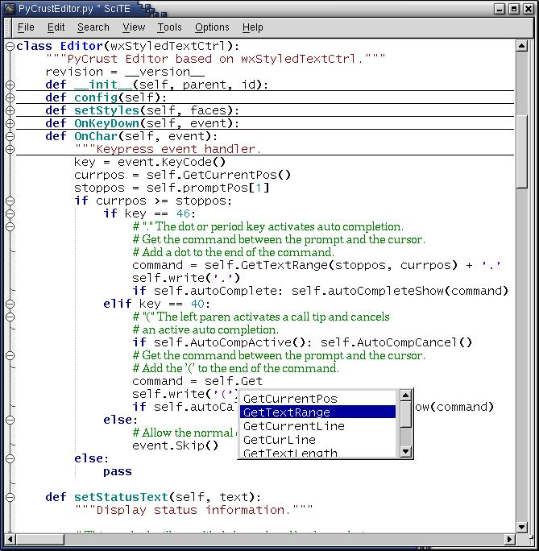



## Source Code Editor, Syntax Hilighter, AutoComplete, All Languages, Uses scintilla\.org

### Description

This is a full source editor for all languages HTML, Perl, C/C++,Java, SQL, etc uses the free dll from scintilla.org. I do not get any credit for this, all credits goes to the authors, I just found here lots of useless submissions on html coloring and sytax hilighting for lots of languages but all of them useless as most of them takes minutes to parse a normal page. Scintilla is a free source code editing component. It comes with complete source code and a license that permits use in any free project or commercial product. The dll and its ource from http://scintilla.org/ and this VB wrapper here http://cvs.sourceforge.net/viewcvs.py/scintilla/ScintillaVB/ . This wrapper is a good start and needs more work since the author seems quit. Remember to set the ScitillaVB property option ForwordFocus to True before compiling the ocx to have the arrow keys working. May be someone can help improving this wrapper as this editor is realy very very nice compared to priced ones like.
 
### More Info
 

             |
---                |---
**Submitted On**   |2002-04-14 18:31:00
**By**             |[Ahmed Amin Elsheshtawy](https://github.com/Planet-Source-Code/PSCIndex/blob/master/ByAuthor/ahmed-amin-elsheshtawy.md)
**Level**          |Advanced
**User Rating**    |5.0 (20 globes from 4 users)
**Compatibility**  |VB 3\.0, VB 4\.0 \(16\-bit\), VB 4\.0 \(32\-bit\), VB 5\.0, VB 6\.0, VB Script, ASP \(Active Server Pages\) , VBA MS Access, VBA MS Excel
**Category**       |[Libraries](https://github.com/Planet-Source-Code/PSCIndex/blob/master/ByCategory/libraries__1-49.md)
**World**          |[Visual Basic](https://github.com/Planet-Source-Code/PSCIndex/blob/master/ByWorld/visual-basic.md)
**Archive File**   |[Source\_Cod1893935282005\.zip](https://github.com/Planet-Source-Code/ahmed-amin-elsheshtawy-source-code-editor-syntax-hilighter-autocomplete-all-languages-uses__1-60770/archive/master.zip)

